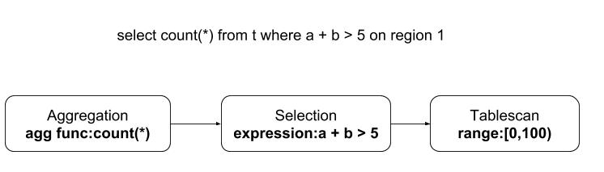

# Distributed SQL 

Now we already know how the TiDB relational structure are encoded into the Key-Value form with versions.  In this section, we will focus on the following questions:

* What happens when [TiDB] receives a SQL query?
* How does [TiDB] excute SQL queries in a distributed way?
  
## What happens when [TiDB] receives a SQL query?

Firstly, let's have a look at the following example:

```
   select count(*) from t where a + b  > 5;
```


As the above figure discribes, when [TiDB] receives a SQL query from the client, it will process according the following steps:

1. [TiDB] receives a new SQL from the client.
2. [TiDB] prepares the process plans for this request, meanwhile [TiDB] get a tso from [PD] as the transaction's `start_ts`.
3. [TiDB] tries to get information schema(meta data of the table) from cache, get from TiKV instead if it not exist.
4. [TiDB] prepares the related regions for each related key according the infomation schema and SQL.Then [TiDB] will get the related regions' information from [PD].
5. [TiDB] groups the related keys by region.
6. [TiDB] dispatches the tasks into the related TiKV concurrently.
7. [TiDB] organize the data and return to the client.

##  How does [TiDB] excute SQL queries in a distributed way?

In short, [TiDB] will split the task by regions and send them to TiKV concurrently.

For the above example, we assume the rows with primary key of the table `t` is distributed in three regions:

* Rows with primary key in [0,100) are in region 1.
* Rows with primary key in [100,1000) are in region 2.
* Rows with primary key in [1000,~) are in region 3.

Then we can just do `count` and sum the result from the above three regions.


### Exectors

Now we know [TiDB] will split the read task according to the regions. Then how do the TiKV know what task should it do?
Here [TiDB] will send TiKV a DAG(Directed Acyclic Graph) with each node is an executor.


Supportted executors:

* TableScan: It will scan the rows with the primary key from the KV store.
* IndexScan: It will scan the index data from the KV store.
* Selection: It will do filter(mostly for `where`), and the input is always from `TableScan` or `IndexScan`.
* Aggregation: It will do aggregation(exp `count(*)`,`sum(xxx)`), and the input could be one of `TableScan`,`IndexScan`,`Selection`.
* TopN: It will order the data and return the top n like `order by xxx limit 10`, and the input could be one of  `TableScan`,`IndexScan`,`Selection`.



For the above example, we have the following executors on region 1:

*  Aggregation: count(*).
*  Selection: a + b > 5
*  TableScan: range:[0,100).


### Expression

We have executors as node in the Directed Acyclic Graph, then how to discribe the columns, constants and functions in the `Aggregation` or `Selection`? 
There are three types of Expressions:

* Column: which means a column in the table.
* Constant: which means a constant, it could be string,int,duration, and so on.
* Scalar function: which describe a function.


For the above example `select count(*) from t where a + b > 5`, we have:

* Column: a,b.
* Scalar functions: `+`,`>`.
* Constant: `5`.


[TiDB]: https://github.com/pingcap/tidb
[PD]: https://github.com/pingcap/pd
