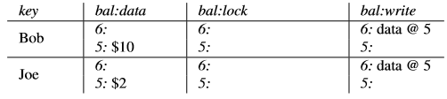
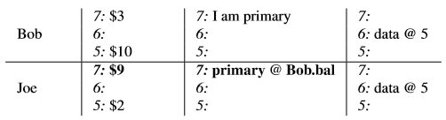
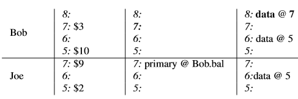
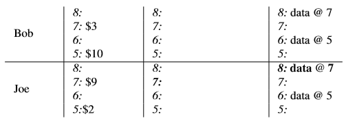

# Percolator

TiKV supports distributed transaction, which is inspired by Google's paper about *Percolator*. We will introduce it and how we make use of it in TiKV in this section.

## What is Percolator?

*Percolator* is a system used for incremental processing on very large data set, built by Google. Support for distributed transactions is only a part of it. We will introduce Percolator briefly here. You can view the full paper [here](https://ai.google/research/pubs/pub36726#), and if you are very familiar to this paper, you can skip this section and go to read [Percolator in TiKV](#Percolator-in-TiKV)

Percolator is built based on Google's BigTable. BigTable is a distributed storage system that supports single-row transactions, based on which Percolator implements distributed transactions in ACID snapshot-isolation semantics. A column `c` of Percolator is actually divided into following 5 internal columns of BigTable:

* `c:lock`
* `c:write`
* `c:data`
* `c:notify`
* `c:ack_O`

`c:notify` and `c:ack_O` are used for Percolator's incremental processing. They are not used by TiKV, so let's ignore these two columns and consider only the first three columns.

Percolator also relies on a service named *timestamp oracle*. The timestamp oracle can produces timestamps in strictly increasing order. All read and write operations need to apply for timestamps from the timestamp oracle, and a timestamp came from timestamp oracle will be regarded as the logical time when the read/write operation happens.

Percolator is multi-version, and a data item's version is represented by the timestamp that the transaction was committed.

For example, in such a state:

<table>
  <tr>
    <th>key</th><th>v:data</th><th>v:lock</th><th>v:write</th>
  </tr>
  <tr>
    <td rowspan="3">k1</td>
    <td>14: "value2"</td><td>14: primary</td><td></td>
  </tr>
  <tr>
    <td></td><td></td><td>12: data@10</td>
  </tr>
  <tr>
    <td>10: "value1"</td><td></td><td></td>
  </tr>
</table>

It means that for the key `k1`, a value `"value1"` was committed at timestamp `12`. Then there is an uncommitted version whose value is `"value2"`, and it's uncommitted because there's a lock. You will understand why it looks like this after understanding how transactions works.

### Writing

Percolator's transactions are committed by a 2PC algorithm. Its two phases are called `Prewrite` and `Commit`.

In `Prewrite` phase:
1. We get a timestamp from the timestamp oracle, and we call the timestamp the transaction's `start_ts`.
2. For each row involved in the transaction, put a lock to `lock` column. At the same time, put the value to the `data` column with the timestamp `start_ts`. One of these locks will be chosen as the *primary* lock, and others are *secondary* locks. Each lock save the transaction's `start_ts`. The secondary locks, in addition, saves the primary lock's location.
    * If we found that there's already a lock or newer version than `start_ts`, the current transaction will be rolled back.

And then, in `Commit` phase:
1. Get another timestamp, namely `commit_ts`.
2. Remove the primary lock, and at the same time write a record to `write` column with the timestamp `commit_ts`, and its value records the transaction's `start_ts`.
    * If the lock is missing, the commit should fail.
3. For all secondaries, do the same thing.

Once the step 2 (committing the primary) is done, we say the whole transaction is done. It doesn't matter if the process of committing the secondaries unexpectedly exited. When we meet a lock of other transactions, we can see whether its primary has been committed to determine whether the whole transaction has been committed.

Let's see the example in the paper of Percolator. Assume we are writing two rows in a single transaction. At first, the data looks like this:

This table shows Bob and Joe's balance. Now Bob want to transfer his $7 to Joe's account. First, we do `Prewrite`:

1. Get the `start_ts` of the transaction. We got `7` in this example.
2. For each row involved in this transaction, put a lock in the `lock` column, and put the data to the `data` column. One of the locks will be chose as the primary lock.

After `Prewrite`, our data looks like this:

Then `Commit`:

1. Get the `commit_ts`. We got `8`.
2. Commit the primary: Remove the primary lock and put the commit record to `write` column. We get this:
    
3. Commit all secondaries. Finally, we get this:
    

### Reading

To read from Percolator, a timestamp is required too. The procedure to perform read operation is as following:

1. Get a timestamp, `ts`.
2. Check if the row we are going to read is locked with timestamp in the range `[0, ts]`;
    * If so, it means the row is locked by a earlier-started transaction. Then we are not sure whether that transaction will be committed before `ts` or after `ts`. Other wise, we can continue reading.
3. Get the latest record in the row's `write` column whose `commit_ts` is in range `[0, ts]`. The record contains the `start_ts` of the transaction where it was committed.
4. Get the row's value in `data` column, whose timestamp is exactly `start_ts`. Then the value is what we want.

For example, consider a table as showed in the image again:

Let's read Bob's balance.
1. Get a timestamp. Assume we got `9`.
2. Check lock. The row of Bob is not locked, so we continue.
3. Get the latest record in `write` column that committed before `9`. We got the record with `commit_ts` equals to `8`, and it says the `start_ts` is `7`, which means, it's corresponding data is at timestamp `7` in `data` column.
4. Get the value in `data` column whose timestamp is exactly `7`. We got `$3`.

This algorithm provides us both lock-free reading and the ability to perform historical read. In the above example, if we specify that we want to read at time point `7`, then we will se the write record at timestamp `6`, giving us the result `$10` at timestamp `5`.

### Handling Conflicts

Conflicts are identified by checking the `lock` column. A row can have many versions of data, but it can have at most one lock at any time.

When we are performing a write operation, we tries to lock every affected rows in the `Prewrite` phase. If we failed to lock some of these rows, the whole transaction will be rolled back. As an optimistic lock algorithm, sometimes it causes a shortage of Percolator: there may be performance regression in a scenario that conflicts occur frequently.

To roll back a row, just simply remove its lock and its corresponding value in `data` column.

### Tolerating crashes

Percolator has the ability to surfer crushing without breaking correctness of data.

First, let's see what will happen after a crash. A crash may happen during `Prewrite`, during `Commit` or between these two. But any way, we can simply divide these conditions into two types: before committing the primary, or after committing the primary.

So, when a transaction `T1` (either reading or writing) finds that a row `R1` has a lock which belongs to an earlier transaction `T0`, it in fact doesn't simply rollback itself immediately. However, it checks the state of the lock's primary.

* If the primary lock disappeared but there's a record `data @ T0.start_ts` in `write` column, it means that `T0` has been successfully committed. Then the row `R1`'s stale lock can also be committed. Usually we call this `rolling forward`. After that, the new transaction `T1` can continue.
* If the primary lock disappeared with nothing left, it means the transaction has been rolled back. Then the row `R1`'s stale lock should also be rolled back. Then `T1` can continue.
* If the primary lock exists but it's too old (we can set a TTL to the lock), we can believe that the transaction crashed before committing or rolling back. We can rollback it and continue `T1`.
* Other wise, we consider transaction `T0` is still running. Then `T1` can rollback it self, or another choice, try to wait for a while to see whether `T0` will be committed before `T1.start_ts`.

## Percolator in TiKV

TiKV is a key-value storage, and each key-value pair can be regarded as a row in Percolator.

TiKV internally uses RocksDB, a key-value storage engine library, to persist data to disk. RocksDB's atomic write batch and TiKV's transaction scheduler make it atomic to read and write a single user key, which is a requirement of Percolator.

RocksDB provides a features named *Column Family* (we will abbreviate it as *CF*). An instance of RocksDB may have multiple CFs, and each CF is a separated key namespace and has its own LSM-Tree. However different CFs in the same RocksDB instance uses a common WAL, providing the ability to write to different CFs atomically.

We divide a RocksDB to three CFs: `CF_DEFAULT`, `CF_LOCK` and `CF_WRITE`, which corresponds to Percolator's `data` column, `lock` column and `write` column respectively. (there's an extra CF named `CF_RAFT` used to save some metadata of Raft, but that's out of our topic now.)

Then, we need to represent different versions of a key. We can simply compound a key and a timestamp as an internal key, and use the internal key in RocksDB. But since a key can have at most one lock at a time, so we don't need to add timestamp to the key in `CF_LOCK`. Then the contents of each CFs are:

* `CF_DEFAULT`: `(key, start_ts)` -> `value`
* `CF_LOCK`: `key` -> `lock_info`
* `CF_WRITE`: `(key, commit_ts)` -> `write_info`

Our technical to compose user keys and timestamps together is:

1. Encode the user key to [memcomparable](https://github.com/facebook/mysql-5.6/wiki/MyRocks-record-format#memcomparable-format)
2. Bitwise invert the timestamp (which is an unsigned int64) and encode it to big-endian bytes
3. Append the encoded timestamp to the encoded key.

For example, the key `"key1"` and the timestamp `3` will be encoded as `"key1\x00\x00\x00\x00\xfb\xff\xff\xff\xff\xff\xff\xff\xfe"`, where the first 9 bytes is the memcomparable-encoded key and the remaining 8 bytes is the inverted timestamp in big-endian. In this way, our different versions of the same key are always adjacent in RocksDB, and for each key, newer versions are always in front of older versions.

There are some differences between TiKV and the Percolator's paper. In tikv, records in `CF_WRITE` has four different types: `Put`, `Delete`, `Rollback` and `Lock`. Only `Put` records need a corresponding value in `CF_DEFAULT`. When rolling back transactions, we doesn't simply remove the lock but writes a `Rollback` record in `CF_WRITE`. The `Lock` type of write records is different from Percolator's lock, but is produced by queries like `SELECT ... FOR UPDATE` in TiDB. For keys affected by this query, although they are only read, it's part of a write operation. To guarantee to be in snapshot-isolation, we make it acts like a write operation (though it doesn't write anything) to ensure the keys are locked and won't change before committing the transaction.
