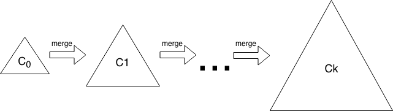

# B-Tree vs Log-Structured Merge-Tree

The [B-tree](https://en.wikipedia.org/wiki/B-tree) and the [Log-Structured Merge-tree](https://en.wikipedia.org/wiki/Log-structured_merge-tree) (LSM-tree) are the two most widely used data structures for data-intensive applications to organize and store data. However, each of them has its own advantages and disadvantages. This article aims to use the quantitative approaches to compare these two data structures. 

## Metrics

In general, there are three critical metrics to measure the performance of a data structure, which include write amplification, read amplification, and space amplification. This section aims to describe these metrics. 

For hard disk drives (HDDs), the cost of disk seek is enormous, so that the performance of random read/write is worse than that of sequential read/write. This article assumes that flash-based storage is used so we can ignore the price of disk seeks.

### Write Amplification

`Write amplification` is the ratio of the amount of data written to the storage device versus the amount of data written to the database. 

For example, if you are writing 10 MB to the database and you observe 30 MB disk write rate, your write amplification is 3.

Flash-based storage can be written to only a finite number of times, so write amplification will decrease the flash lifetime.

There is another write amplification associated with the flash memory and SSDs because flash memory must be erased before it can be rewritten.

### Read Amplification

`Read amplification` is the number of disk reads per query. 

For example, if you need to read 5 pages to answer a query, read amplification is 5. 

Note that the units of write amplification and read amplification are different. Write amplification measures how much more data is written than the application thought it was writing, whereas read amplification counts the number of disk reads to perform a query.

Read amplification is defined separately for point query and range queries. For range queries the range length matters (the number of rows to be fetched). 

Caching is a critical factor for read amplification. For example a B-tree in the cold-cache case, a point query requires \\(O(log_BN)\\) disk reads, whereas in the warm-cache case the internal nodes of the B-tree are cached, and so a B-tree requires at most one disk read per query.

### Space Amplification

`Space amplification` is the ratio of the amount of data on the storage device versus the amount of data on the database. 

For example, if you put 10MB in the database and this database uses 100MB on the disk, then the space amplification is 10.

Generally speaking, a data structure can optimize for at most two from read, write, and space amplification. This means one data structure is unlikely to be better than another at all three. For example a B-tree has less read amplification than an LSM-tree while an LSM-tree has less write amplification than a B-tree. 

## Analysis

The B-tree is a generalization of [binary search tree](https://en.wikipedia.org/wiki/Binary_search_tree) in which a node can have more than two children. There are two kinds of node in B-tree, internal nodes ,and leaf nodes. A leaf node contains data records and has no children, whereas an internal node can have a variable number of child nodes within some pre-defined range, internal nodes may be joined or split. An example of B-tree appears in *Figure 1*.

> Figure 1. The root node is shown at the top of the tree, and in this case happens to contain a single pivot (20), indicating that records with key k where k ≤ 20 are stored in the first child, and records with key k where k > 20 are stored in the second child. The first child contains two pivot keys (11 and 15), indicating that records with key k where k ≤ 11 is stored in the first child, those with 11 < k ≤ 15 are stored in the second child, and those with k > 15 are stored in the third child. The leftmost leaf node contains four values (3, 5, and 7).

The term B-tree may refer to a specific design or a general class of designs. In the narrow sense, a B-tree stores keys in its internal nodes but need not store those keys in the records at the leaves. The [B+ tree](https://en.wikipedia.org/wiki/B%2B_tree#Insertion) is one of the most famous variations of B-tree. The idea behind B+ tree is that internal nodes only contain keys, and an additional level which contains values is added at the bottom with linked leaves.

LSM-tree is just like other search trees, it contains key-value pairs. It maintains data in two or more separate components, each of which is optimized for its respective underlying storage medium; the data i n the low level component is efficiently merged with the data in the high level component in batches. An example of LSM-tree appears in *Figure 2*.

> Figure 2. The LSM-tree contains \\(k\\) components. Data starts in \\(C_0\\), then gets merged into the \\(C_1\\). Eventually the \\(C_1\\) is merged into the \\(C_2\\), and so forth.

LSM-tree performs `compaction` to merge several `SSTable`s into one new `SSTable` which contains only the live data from the input `SSTable`s. Compaction helps LSM-tree to recycle space and reduce read amplification. There are two kinds of `compaction strategy` which  `Size-Tiered compaction strategy` (STCS) and `Level-Based compaction strategy` (LBCS). The idea behind STCS is to compact small `SSTable`s into medium `SSTable`s when LSM-tree has enough small `SSTable`s and compacting medium `SSTable`s into large `SSTable`s when LSM-tree has enough medium `SSTable`s. The idea of LBCS is to organize data into levels and each level contains one sorted run. Once a level accumulates enough data, some of data at this level will be compacted to the higher level.

This section discusses the write amplification and read amplification of B+tree and Level-Based LSM-tree. 

### B+ Tree

In the B+ tree, copies of the keys are stored in the internal nodes; the keys and records are stored in leaves; in addition, a leaf node may include a pointer to the next leaf node to increase sequential access performance.

To simplify the analysis, assume that the block size of the tree is \\(B\\) measured in bytes, and keys, pointers, and records are constant size, so that each internal node contains \\(O(B)\\) children and each leaf contains \\(O(B)\\) data records. (The root node is a special case, and can be nearly empty in some situations.) Under all these assumptions, the depth of a B+ tree is 
$$
O(log_BN/B)
$$
where \\(N\\) is the size of the database.

#### Write Amplification

For the worst-case insertion workloads, every insertion requires writing the leaf block containing the record, so the write amplification is \\(B\\).

#### Read Amplification

The number of disk reads for query is at most \\(O(log_BN/B)\\) which is the depth of the tree. 

### Level-Based LSM-tree

In the Level-based LSM-tree, data is organized into levels. Each level contains one sorted run. Data starts in level 0, then gets merged into the level 1 run. Eventually the level 1 run is merged into the level 2 run, and so forth. Each level is constrained in its sizes. Growth factor \\(k\\) is specified as the magnification of data size at each level.

$$
level_i = level_{i-1} * k
$$
We can analyze the Level-based LSM-tree as follows. If the growth factor is \\(k\\) and the smallest level is a single file of size \\(B\\), then the number of levels is 

$$
Θ(log_kN/B)
$$
where \\(N\\) is the size of the database. In order to simplify the analysis, we assumes that database size is stable and grows slowly over time, so that the size of database will be nearly equal as the size of last level.

#### Write Amplification

Data must be moved out of each level once, but data from a given level is merged repeatedly with data from the previous level. On average, after being first written into a level, each data item is remerged back into the same level about \\(k/2\\) times. So the total write amplification is 
$$
Θ(k*log_kN/B)
$$

#### Read Amplification

To perform a short range query in the cold cache case, we must perform a binary search
on each of the levels.

For the highest \\(level_i\\), the data size is \\(O(N)\\), so that it performs \\(O(logN/B)\\) disk reads. 

For the previous \\(level_{i-1}\\), the data size is is \\(O(N/k)\\), so that it performs \\(O(log(N/(kB))\\) disk reads. 

For \\(level_{i-2}\\), the data size is \\(O(N/k^2)\\), so that it performs \\(O(log(N/k^2B)\\) disk reads.

…

For \\(level_{i-n}\\), the data size is \\(O(N/k^n)\\), so that it performs \\(O(log(N/k^nB)\\) disk reads.

So that the total number of disk reads is 

$$
R = O(logN/B) + O(log(N/(kB)) + O(log(N/k^2B) + ... + O(log(N/k^nB) + 1 = O((log^2N/B)/logk)
$$

## Summary

The following table shows the summary of various kinds of amplification:

|    Data Structure    | Write Amplification |    Read Amplification    |
| :------------------: | :-----------------: | :----------------------: |
|       B+ tree        |     \\(Θ(B)\\)      |    \\(O(log_BN/B)\\)     |
| Level-Based LSM-tree | \\(Θ(klog_kN/B)\\)  | \\(Θ((log^2N/B)/logk)\\) |

> Table 1. A summary of the write amplification and read amplification for range queries.

Through comparing various kinds of amplification between B+ tree and Level-based LSM-tree, we can come to a conclusion that Level-based LSM-tree has a better write performance than B+ tree while its read performance is not as good as B+ tree. The main purpose for TiKV to use LSM-tree instead of B-tree as its underlying storage engine is because using cache technology to promote read performance is much easier than promote write performance.