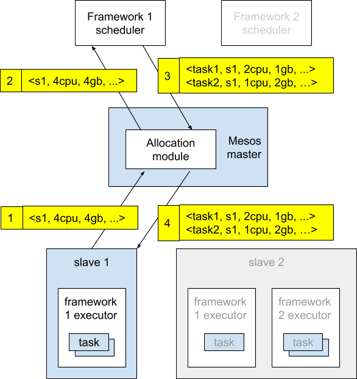

# Mesos

## Overview

Mesos was originally launched by UC Berkeley's AMPLab in 2009. It is lisenced under Apache and now operated by Mesosphere, Inc.

Mesos can abstract and schedule the resources of the entire data center (including CPU, memory, storage, network, etc.), so that multiple applications can run in the cluster at the same time, and do not need to care about the physical distribution of resources.

Mesos has many compelling features, including:

- Supports large scale scenarios with tens of thousands of nodes (adopted by Apple, Twitter, eBay, etc.)
- Supports multiple application frameworks, including Marathon, Singularity, Aurora, etc.
- High Available (rely on ZooKeeper)
- Supports Docker, LXC and other container techniques
- Provides API for several popular languages, including Python, Java, C++, etc.
- Comes with a simple and easy-to-use WebUI

## Architecture

It is important to notice that Mesos itself is a resource scheduling framework. It is not a complete application management platform, so Mesos can't work only on its own. However, based on Mesos, it is relatively easy to provide distributed operation capabilities for various application management frameworks or middleware platforms. Multiple frameworks can also run in a single Mesos cluster at the same time, improving overall resource utilization efficiency.

## Components

Mesos consists of a master process that manages slave daemons running on each cluster node, and frameworks that run tasks on these slaves.

- Mesos master

    The _master_ sees the global information, and is responsible for resource scheduling and logical control between different _frameworks_. The _frameworks_ need to be registered to _master_ in order to be used. It uses Zookeeper to achieve HA.

- Mesos salve

    The _slave_ is responsible for reporting the resource status (idle resources, running status, etc.) on the slave node to _master_, and is responsible for isolating the local resources to perform the specific tasks assigned by master.

- Frameworks

    Each _framework_ consists of two components: a _scheduler_ that registers with the _master_ to be offered resources, and an _executor_ process that is launched on _slave_ nodes to run the _framework_’s tasks.

## Resource scheduling
To support the sophisticated schedulers of today's frameworks, Mesos introduces a distributed two-level scheduling mechanism called _resource offers_.

Each resource offer is a list of free resources (for example, <1Core CPU, 2GB RAM>) on multiple slaves. While the _master_ decides how many resources to offer to each framework according to an organizational policy, the frameworks’ schedulers select which of the offered resources to use. When a framework accepts offered resources, it passes Mesos a description of the tasks it wants to launch on them.

The figure shows an example of how resource scheduling works:

1. Slave 1 reports to the master that it has 4 CPUs and 4 GB of memory free. The master then invokes the allocation policy module, which tells it that framework 1 should be offered all available resources.
2. The master sends a resource offer describing what is available on slave 1 to framework 1.
3. The framework’s scheduler replies to the master with information about two tasks to run on the slave, using <2 CPUs, 1 GB RAM> for the first task, and <1 CPUs, 2 GB RAM> for the second task.
4. Finally, the master sends the tasks to the slave, which allocates appropriate resources to the framework’s executor, which in turn launches the two tasks (depicted with dotted-line borders in the figure). Because 1 CPU and 1 GB of RAM are still unallocated, the allocation module may now offer them to framework 2.

To maintain a thin interface and enable frameworks to evolve independently, Mesos does not require frameworks to specify their resource requirements or constraints. Instead, Mesos gives frameworks the ability to reject offers. A framework can reject resources that do not satisfy its constraints in order to wait for ones that do. Thus, the rejection mechanism enables frameworks to support arbitrarily complex resource constraints while keeping Mesos simple and scalable.

## References
1. [Mesos: A Platform for Fine-Grained Resource Sharing in the Data Center](https://people.eecs.berkeley.edu/~alig/papers/mesos.pdf)
2. [Mesos introduction (in Chinese)](https://yeasy.gitbooks.io/docker_practice/mesos/intro.html)
