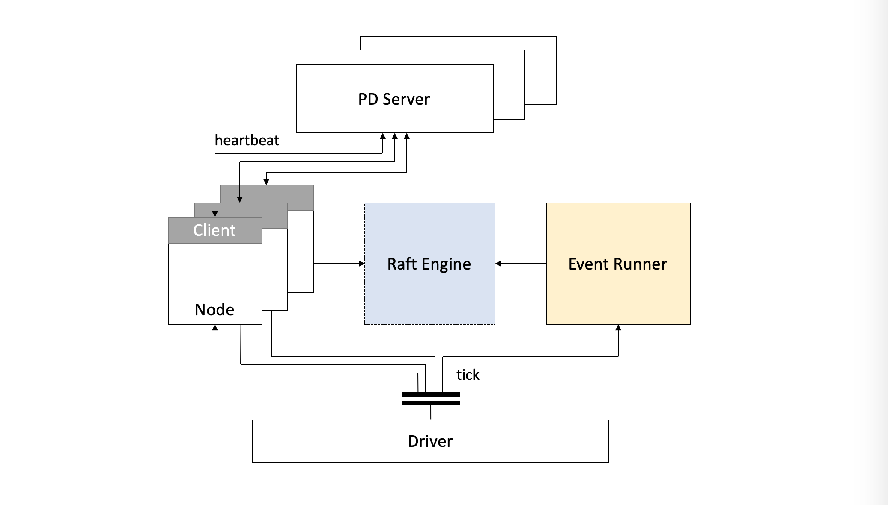

# Simulator

## Overview

With its flexibility and significant benefits of reducing time and cost, the
simulator plays an important role in studying and designing a computer
architecture. It is often used to validate specific design schemes
and evaluate the effectiveness of design schemes.

## Workflow

We'll focus on how the simulator is used in TiKV to deal with scheduling
problems.
In general, when there is a lack of resources or the problem is hard to
reproduce, we might consider using the simulator.

A simulation for the scheduling problem in the distributed system
usually consists of the following steps:

1. Define the system model of the simulator.
2. Set up the simulation environment.
3. Run the simulation.
4. Inspect the result to check whether it is in line with the expectation.

The first step is mainly to figure out which part of your system you want to
simulate. And the model should be as simple as possible. In the second step,
you should set up the environment including the scale of your system and the
characteristics of the workload. In the third step, the simulation will run
and provide the scheduling output. In the final step, you can check the
result and dig into the scheduling problem if the result is not as expected.

## PD Simulator

In PD, we also need a simulator to locate a scheduling problem.
The simulator can be used to simulate a large-scale cluster and scenarios
with different users.
And for some special scenarios, we can keep them so that we can quickly
verify the correctness of the scheduling in PD under different scenarios
when we reconstruct the code or add some new features in the future. Without
the simulator, if we want to reproduce some scenarios, we need to apply for
machines, load data, and then wait for the scheduling. It is tedious and
might waste a lot of time.

### Architecture

The basic architecture of PD Simulator is shown in *Figure 1*.

### Components

PD Simulator consists of the following components:

- Driver

  _Driver_ is the most important part of the PD Simulator. It is used to do
  some initialization and trigger the heartbeat and the corresponding event
  according to the tick count.

- Node

  _Node_ is used to simulate a TiKV node. It contains the basic information
  of a store and can communicate with PD by using the heartbeat through gRPC.

- Raft Engine

  _Raft Engine_ records all Raft related information. It is a shared Raft
  engine which PD cannot know about.

- Event Runner

  For every tick, _Event Runner_ checks if there is an event to execute. if
  there is, it will execute the corresponding event.

### Process

The basic process of how PD Simulator works is as follows:

1. When started, PD Simulator will create a driver and initialize a mocked
TiKV cluster which consists of nodes.
2. After PD is bootstrapped, it starts a timer.
3. For each tick, the mocked TiKV cluster will perform some operations, such
as executing Raft commands on the shared Raft engine or sending heartbeats.
The operation to perform depends on the specific case.
4. Finally, PD Simulator will verify whether the result is in line with our
expectations.

PD Simulator does not care about how TiKV actually works in details. It just
sends the messages which PD wants to know about.
