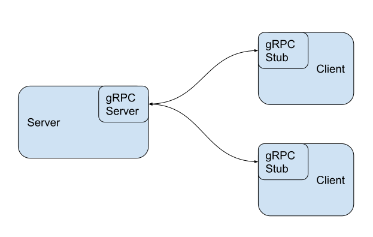

# gRPC

Sitting on top of HTTP/2 and protobuf gRPC provides a high performance RPC
framework. It supports features such as bi-directional streaming and authentication.

gRPC is also part of the [CNCF](https://www.cncf.io/projects/). It is commonly
used in applications like Kubernetes or TiKV.

## Servers and Stubs

gRPC works off the idea that there is a *server* node which can accept
*requests* from *stub* client nodes.

The *server* implements the service interface and runs a gRPC server to handle
all the incoming RPC calls from the client *stubs*. The *stubs* which clients
have provide the same methods that the server implements, but instead send the
request to the server.



## Streams

Sometimes it's convienent to return or accept a stream of messages, instead of
operating in the traditional 1:1 request response format.

gRPC supports both of these, enabling bi-directional streaming so clients and
servers can write in whatever order they like. gRPC maintains ordering behind
the scenes.

```protobuf
service StreamScan {
  rpc BatchGet (string, string) returns (stream string) {};
}
```

## A Rust Crate

One of the TiKV maintaining organizations, PingCAP, maintains the
[`grpc-rs`](https://github.com/pingcap/grpc-rs) library, providing Rust bindings
to the C library of gRPC.
